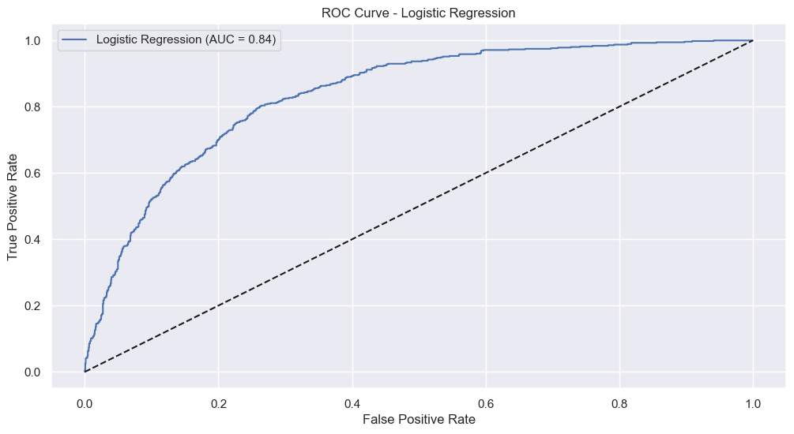
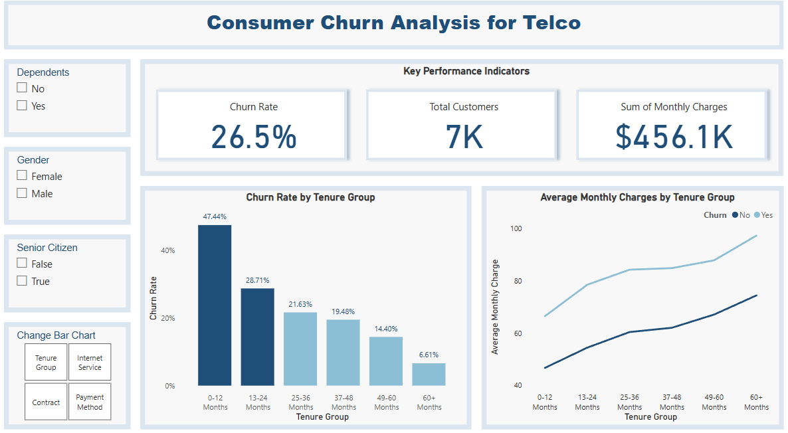

# Customer Churn Analysis and Predictions

---

## Executive Summary
This project focuses on providing a high-level visualisations of consumer churn at a fictional company, Telco, and train a machine learning model (Logistic Regression) to provide a GUI for predicting churn.
The main objective is to identify which customers are likely to leave based on relevant features. The results were then validated using metrics, like **ROC Curve** and **Confusion Matrix**.
A PowerBI dashboard was then created to provide a high level overview of consumer churn using visualisations. 

1. Clean Data
2. Perform EDA
3. Make a PowerBI Dashboard
4. Train a machine learning model to implement a GUI for predicting a consumer's propensity to churn

---

### Machine Learning ROC Curve 

The following **ROC Curve** evaluates the performance of the logistic regression model in differentiating churners and non-churners. A higher **AUC** (Area Under the Curve) indicates better performance and reliability.

The True Positive Rate is the proportion of actual churners correctly identified, and the False Positive Rate is the proportion of non-churners incorrectly classed as positive. 

The AUC of 0.84 suggests the model performs well in distinguishing between churners and non-churners. 

To interpret the curve, the diagonal dashed line represents the performance of a random classifier (0.5 AUC), the blue curve represents the actual model used and as the model moves towards the top left, it indicates better performance. 

{:width="500px" height="auto"}

---

### Dashboard

Below is a screenshot of the **PowerBI Dashboard** used for providing a high level overview of consumer churn using visualisations 

{:width="500px" height="auto"}

If you'd like to view and interact with the dashboard in Power BI Desktop, you can download the **PBIX** file from the following link:

- [Download PBIX from the Repostitory](https://github.com/AyoubGutin/Customer-Churn)

---

### Link to GitHub Repository
- [Customer Churn GitHub Repo](https://github.com/AyoubGutin/Customer-Churn)
